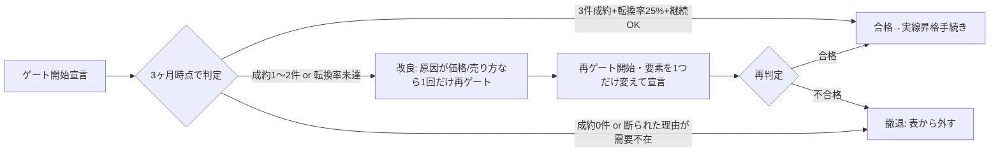

# ステージゲート判定テンプレ — 「手売り3件検証」の判定様式

作成: 2026-08-02 / 根拠: docs/月300万ストック化プラン_2027-08目標_2026-07-30.md 改訂3(全数値にステージゲート適用)・達成確率設計ループ3/4
原則: 8商品の全行は〔点線=未検証〕から始まる。**ゲート合格まで自動化・拡大・広告・表の実線化は禁止**。判定は三名体制議事つきで統括(アカリさん)経由、実線昇格の最終決裁は小柳さん。

## 1. ゲート定義(商品ごとに開始時に固定する)

| 項目 | 定義 | 標準値(商品別に上書き可) |
|---|---|---|
| 検証件数 | 手売り(創業者自身の販売)での有償成約数 | **3件**(無償・モニター・身内は数えない) |
| 検証期間 | ゲート開始宣言日から | **3ヶ月**(期限延長は1回・小柳さん決裁のみ) |
| 転換率 | 商談(提案提示)→成約 | **25%以上**(=12商談以内で3成約) |
| 継続条件 | 成約後の初回更新(月額型) | 3件中2件以上が翌月継続 |
| 開始条件 | 価格・提供内容・提供手順が1枚に書けていること | ゲート開始宣言を決裁ログに記録 |

## 2. 判定フロー

- **合格→実線昇格の手続き**: ①判定記録(下記様式)を作成 ②三名体制議事を添付 ③統括経由で小柳さんへ上申・決裁 ④ストック化プランの該当行を〔実線〕に書き換え ⑤自動化・拡大の実装に着手 ⑥昇格後も早期警報(解約率)の監視対象に登録
- **不合格→撤退/改良の判断基準**: 断られた理由の多数が「要らない(需要不在)」なら**撤退**。「高い/今じゃない/売り方が分からない(提供側の問題)」なら**改良して再ゲート1回のみ**。再ゲートでは変更要素を1つに限定(価格 or 対象顧客 or 提供形態)し、何を変えたかを宣言に明記
- 撤退・不合格・断られた商談はすべて **docs/失敗台帳_商談版フォーマット.md** に48時間以内に記録(前提破壊レビューの材料)
- ゲート不合格が累計2本に達したら、達成時期の後ろ倒し判断を早期警報ループが決裁キューへ自動起票(2027-01判断)

## 3. 判定記録の様式+記入例

| 項目 | 記入例(サンプル: ノビシロ顧問・ゲート1) |
|---|---|
| 商品名 / プラン | ノビシロ顧問(AIコンサル)8/15/30万プラン |
| ゲート開始宣言日 / 判定期限 | 2026-08-15 / 2026-11-15 |
| ゲート定義 | 手売り3社・3ヶ月・転換率25%・翌月継続2/3 |
| 商談数 / 成約数 / 転換率 | 9商談 / 3成約 / 33% |
| 継続状況 | 3社中3社が翌月継続 |
| 断られた6件の理由分布 | 高い2・今じゃない3・需要不在1(詳細は失敗台帳_商談版 SD-001〜006) |
| 三名体制議事 | スイシン: 転換率33%で基準超・昇格推進 / **ウタガイ: 3件は全て既存人脈経由。人脈外で売れる証明になっていない。昇格後の拡大チャネル未検証のまま自動化投資するリスク** / ベッカイ: 昇格は15万プランのみに限定し、8万・30万は別ゲート扱いにする案 |
| 判定 | **合格(条件付き)** — 実線昇格はゲート実績のある15万プラン相当のみ。拡大は人脈外チャネル(診断自動販売機経由)の初成約を昇格後30日の追加確認条件とする |
| 上申 / 決裁 | 2026-11-17 統括経由で上申 → 小柳さん決裁待ち |
| 見直し期限 | 2027-05-15(6ヶ月・実線後の解約率と併せ再議論) |

※記入例は様式説明のための仮想値。実判定では実データのみを記入し、金額の実額は公開リポジトリに書かない(プラン名・件数・率のみ)。
