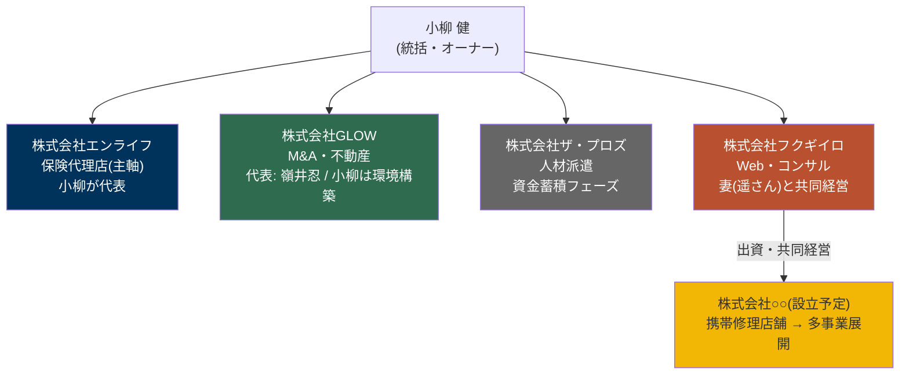
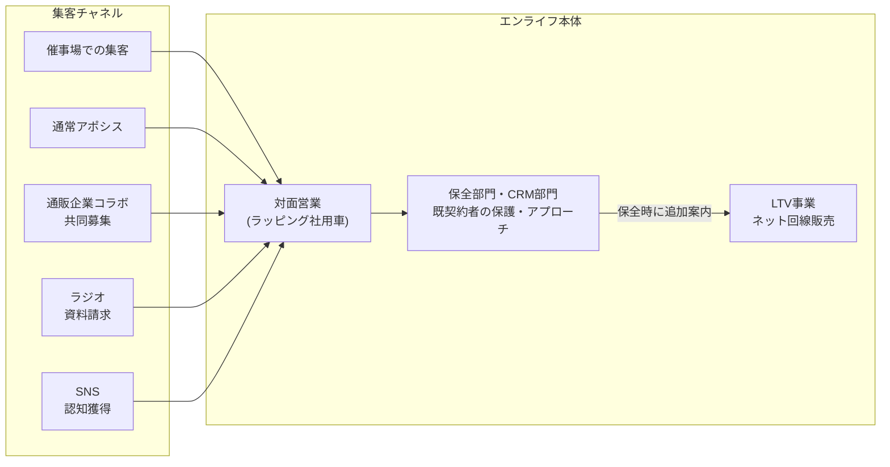
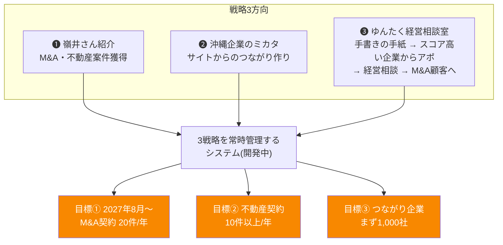
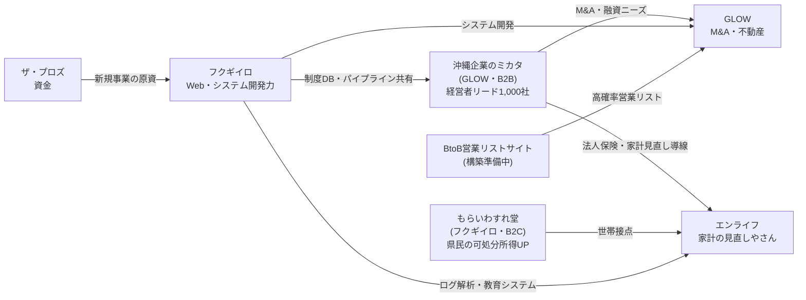
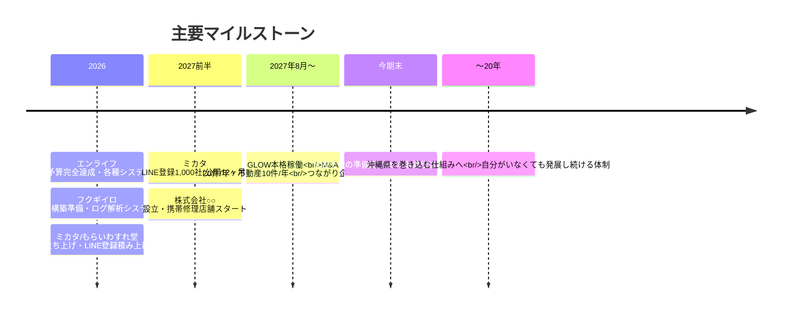
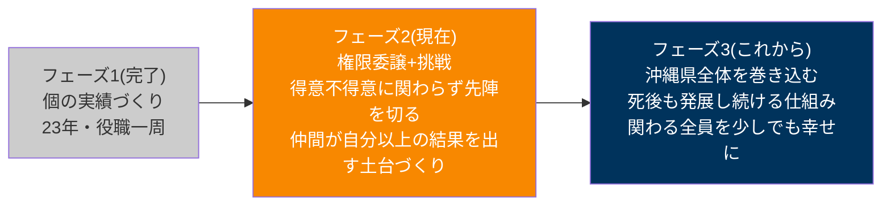

# 小柳健 事業ポートフォリオ整理

作成日: 2026-07-29 / 本人記述をもとに構造化

---

## 1. 全体像(5社+設立予定1社)



| 会社 | 主軸事業 | 現フェーズ | 小柳さんの役割 |
|---|---|---|---|
| エンライフ | 保険代理店(家計の見直しやさん) | 拡大(9部門・全部門予算完全達成を目指す) | 代表(今期を最後と設定) |
| GLOW | M&A・不動産 | 体制構築(2027年8月本格稼働目標) | 環境・システムづくり |
| ザ・プロズ | 人材派遣 | 資金蓄積(パートナー企業を稼働) | オーナー |
| フクギイロ | Webデザイン・コンサル・サイト運営 | 多サイト立ち上げ準備 | 共同経営(コンサル・システム開発担当) |
| ○○(設立予定) | 携帯修理→多事業展開 | 設立準備 | フクギイロ経由の出資者 |

---

## 2. 株式会社エンライフ(保険代理店・主軸)

**戦略: 「家計の見直しやさん」ブランドを沖縄県内に選択と集中で拡大。対面営業特化。**



### 現状の強み
- 9部門構成・全部門の予算完全達成を目標
- 保険協会の認定を取得
- 保全・CRM部門による既契約ユーザーの保護体制

### 構築中(社内環境・システム)
| # | 構築中のもの | 目的 |
|---|---|---|
| 1 | AI環境整備 | 家計の見直しサイト・SNSが自走する体制 |
| 2 | エンライフ専用 保全管理システム | 既契約者フォローの仕組み化 |
| 3 | 業績連動型ログ解析教育システム | 成績とログを結び付けた教育 |
| 4 | 社内イントラネット | 情報共有基盤 |
| 5 | 自動配信システム | 顧客・見込み客への自動アプローチ |

---

## 3. 株式会社GLOW(M&A・不動産)

**代表: 嶺井忍 / 小柳さんはその活動が回る環境・システムを構築中。沖縄のBtoB開拓が狙い。**



※ 「沖縄企業のミカタ」(本リポジトリの事業)は、GLOWにとっての **経営者リード獲得装置**(出口2: M&A・融資ニーズの接続)として位置づけ。KGIの LINE登録1,000社 は、GLOWの「つながり企業1,000社」目標と直結する。

---

## 4. 株式会社ザ・プロズ(人材派遣)

- 主軸: 人材派遣業
- 現フェーズ: **資金蓄積**。パートナー企業を動かして現金を貯めている段階
- 次の展開(新規事業・出資)の原資となる位置づけ

---

## 5. 株式会社フクギイロ(Web・コンサル)

**妻(遥さん)と共同経営。役割分担が明確。**

> **2026-08-11 追記(小柳さん共有)**: フクギイロが関わる事業は「①もらい忘れ(もらいわすれ堂)②webデザイン制作 ③システム経営コンサル」の3つ、と整理された(③は下図のあいおい生命コンサル・ログ解析システム開発の系譜)。以下の図表は2026-07-29時点の記録として残す。HP等の対外表記はこの3事業のみとする(docs/フクギイロ_HPリニューアル_指示プロンプト設計.md 参照)。

```mermaid
graph TD
    subgraph 遥さん担当
        W["Webデザイン収益"]
    end

    subgraph 小柳さん担当
        A["あいおい生命コンサル"]
        A2["あいおい生命専用<br/>CC対応 成績連動ログ解析教育システム(開発中)"]
        A3["催事場ビジネス企業向け<br/>成績連動型ログ解析システム(開発予定)"]
    end

    subgraph サイト運営・構築
        M["もらいわすれ堂(運営中)<br/>県民の可処分所得を上げる"]
        P1["沖縄ヴィラ専門予約サイト"]
        P2["BtoB企業情報×掛け合わせ<br/>高確率営業リストサイト"]
        P3["AIコンサルサイト"]
        P4["NUROユーザー集客サイト"]
        P5["(自動化運営サイト)"]
    end

    OUT["出資 → 株式会社○○(設立予定)<br/>携帯修理店舗 → 収益を多事業へ展開"]
    W --> OUT
    A --> OUT

    style M fill:#B9502F,color:#fff
```

### タスク一覧(フクギイロ)
| 区分 | 項目 | 状態 |
|---|---|---|
| 収益 | Webデザイン(遥さん) | 稼働中 |
| 収益 | あいおい生命コンサル | 稼働中 |
| 開発 | あいおい専用CC対応 成績連動ログ解析教育システム | 開発中 |
| 開発 | 催事場ビジネス企業向けログ解析システム | 開発予定 |
| 運営 | もらいわすれ堂(県民向け給付金・制度案内) | 運営中 |
| 構築準備 | 沖縄ヴィラ専門予約サイト | 準備中 |
| 構築準備 | BtoB営業対象リスト抽出サイト | 準備中 |
| 構築準備 | AIコンサルサイト | 準備中 |
| 構築準備 | NUROユーザー集客サイト | 準備中 |
| 投資 | 携帯修理会社(株式会社○○)への出資・共同経営 | 設立準備 |

---

## 6. グループシナジー(事業間のつながり)



ポイント:
- **制度情報DB(収集パイプライン)** が B2B(ミカタ)と B2C(もらいわすれ堂)の共通資産
- **フクギイロの開発力**(ログ解析・自動化)が全社の武器として横展開されている
- **ザ・プロズの資金** と **フクギイロの出資** が次の会社(携帯修理→多事業)を生む

---

## 7. ロードマップ



---

## 8. 経営者としての現在地とフェーズ転換

### これまで(23年間)
- 新卒 → 係長 → 課長 → 副部長 → 部長 → 執行役員 → 取締役 → 代表 → 株主。経営12年(干支一周)
- ファイナンス・投資家対応・買収を複数回経験
- **リストラゼロ・入社以来給与が下がった社員ゼロ**
- 平均給与は沖縄県内 TOP20以内を確立(途中経過)

### いま(フェーズ転換)


### 決めていること
1. **代表としては今期を最後**と設定
2. 様々な形で**取締役以上を輩出**し、次の未来につなげる
3. 残り健康寿命 約20年を、**個の能力を超える仕組みづくりに全ベット**
4. 判断軸: 「どうやったら沖縄県の人達や企業を巻き込んで、この県を良くしていけるか」

---

## 9. 直近の重点タスク(横断サマリ)

| 優先 | 会社 | タスク | 種別 |
|---|---|---|---|
| ◎ | エンライフ | 保全管理/ログ解析教育/イントラ/自動配信 の4システム構築 | システム |
| ◎ | エンライフ | サイト・SNSが自走するAI環境整備 | 環境 |
| ◎ | GLOW | 戦略3方向を常時管理するシステム開発 | システム |
| ◎ | GLOW | ゆんたく経営相談室(手紙→スコア→アポ)の運用 | 営業 |
| ○ | フクギイロ | あいおい専用CC対応ログ解析教育システム開発 | システム |
| ○ | フクギイロ | 5サイトの構築準備(ヴィラ/BtoBリスト/AIコンサル/NURO/自動化) | サイト |
| ○ | フクギイロ | 株式会社○○(携帯修理)の設立・出資スキーム | 投資 |
| ○ | ザ・プロズ | パートナー企業経由の資金蓄積の継続 | 財務 |
| ◎ | 全社 | 取締役以上の輩出・権限委譲の設計 | 組織 |
