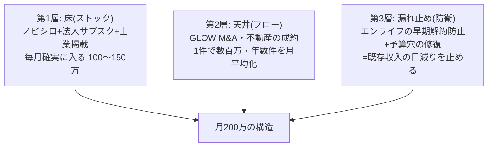
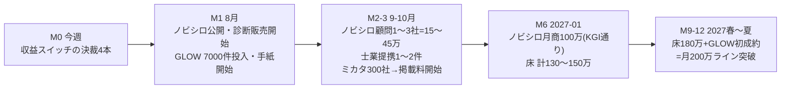

# 月200万 逆算ロードマップ(2026-07-30)

目的: 現在走っている全チャットの事業群から、**新規収益 月200万円**に最短で到達する道筋を逆算する。
前提: 既存エンライフ本業の収入とは別枠の「新規事業群の月次収益」として設計。数字が明文化されているものと仮定のものを区別する。

---

## 1. 結論: 「三層構造」で作るのが最短

月200万を1本の事業で狙うと、確率が一番高いGLOW(M&A)は**入金が不定期(lumpy)**で、月次の「200万」にならない。逆に確実なストック型だけだと時間がかかる。答えは3層の重ね合わせ:

- **第1層(床)**: 唯一、価格表と月商KGIが既に文書化されているのは**ノビシロ**(ライト8万/スタンダード15万/プロ30万、KGI=半年で月商100万=スタンダード5〜7社)。これを主砲にする
- **第2層(天井)**: GLOWは1成約で月200万を軽々超えるが、2027年8月体制が目標でリードタイムが長い。**前倒しの鍵は7000件リストの投入時期**(システムは完成済み)
- **第3層(漏れ止め)**: 収入を「増やす」のと同じ効果を持つのが「減らさない」こと。早期解約リスク保全(継続手数料の防衛)と、参謀本部の予算穴修復(▲685万の是正)は、実質の手残り改善として最速

## 2. 月200万の構成例(12ヶ月後の姿)

| 層 | 収益源 | 単価 | 件数 | 月次 | 根拠の状態 |
|---|---|---|---|---|---|
| 床 | ノビシロ顧問(スタンダード中心) | 15万 | 7社 | 105万 | ✅ 価格表・KGI文書化済み(KGIの月商100万を7〜12ヶ月で) |
| 床 | ノビシロ診断(入口商品) | 1.48万 | 10件 | 15万 | ✅ Stripe実装済み・単価確定 |
| 床 | もらいわすれ堂 法人サブスク | 仮3〜5万 | 5社 | 20万 | 🟡 提案書draft有り・**価格は未決裁** |
| 床 | ミカタ 士業・専門家の定額掲載料 | 仮2〜3万 | 5事務所 | 12万 | 🟡 「定額掲載料方式」と法務ルール化済み・**金額未決裁**(公開トリガー=LINE登録300社) |
| 床 | フクギイロ コンサル(あいおい系+催事企業向けログ解析) | — | — | 30万 | 🟡 既に一部稼働中(実額は要ヒアリング) |
| **床 計** | | | | **約180万** | |
| 天井 | GLOW M&A・不動産(年3〜4件を月平均) | 数百万/件 | — | +50〜100万相当 | 🟡 体制構築中。**1件成約で単月は大幅超過** |

→ **床だけで180万に届く設計にし、GLOWの成約は「200万を超えるかどうか」でなく「いつ超えるか」の変数にする。** これなら毎月の200万が運任せにならない。

## 3. 逆算タイムライン

### M0(今週): 決裁4本 — これが200万への「スイッチ」

| # | 決裁 | 開く収益 |
|---|---|---|
| 1 | **ノビシロ: ブランド確定+掲載承認+特商法【要記入】+Stripe実アカウント** | 床の主砲(105万+15万)の販売開始。**200万の6割がこの1決裁の下流** |
| 2 | **出口座組の4問回答**(型・提携先・同意フロー・時期)→弁護士確認へ | もらいわすれ堂サブスク20万+ミカタ士業掲載12万の前提 |
| 3 | **GLOW: 7000件リストの受け渡し**(嶺井さんと) | 天井の前倒し。手紙→ゆんたく→案件のパイプラインが回り始める |
| 4 | **保全システム: 外部専門家アポ→実データ投入ゲート開始** | 第3層。早期解約1件防止=継続手数料がそのまま残る |

### M1(8月)
- ノビシロ公開・診断販売開始(目標: 診断5件=7.4万。テストE2E→本番切替)
- GLOW: 手紙DM開始(月100〜200通ペース)。スコア上位から
- もらいわすれ堂: LINE運用開始(§D反映)→受給報告→実績カウンター→**「実績が語る」状態を作る**(法人サブスク・士業提携の営業素材になる)
- 広告予算の決裁(ノビシロ設計書の未決事項。診断のCPA検証用に小さく)

### M2〜M3(9〜10月)
- ノビシロ: 診断購入者→顧問転換の初契約1〜3社(15〜45万/月)
- 士業定額提携: 嶺井さん人脈3事務所の先行掲載(無料/割引)→有料化の実績づくり
- ミカタ: LINE登録300社到達(現ペース+自動投稿稼働で加速)→専門家掲載の公開
- GLOW: ゆんたく相談の初回アポ群→M&A・不動産の案件化第1号

### M6(2027年1月)
- ノビシロKGI達成判定: 月商100万(スタンダード5〜7社 or 混合)
- 床の合計130〜150万。不足があればここで「診断の広告増 or 法人サブスク価格改定」を判断

### M9〜M12(2027年春〜夏)
- 床180万+GLOW初成約 → **月200万ライン突破**
- GLOWの2027年8月「M&A20件/年体制」はこの延長線(200万は通過点になる)

## 4. いま走っているタスクとの接続(全部この3層のどれか)

| 現在のタスク | 層 | 収益への意味 |
|---|---|---|
| ノビシロPR#8マージ→決裁→公開 | 床 | 主砲の販売開始 |
| 出口座組4問・法人サブスク決裁 | 床 | 第2・第3の床 |
| もらいわすれ堂LINE §D反映 | 床 | 実績カウンター=営業素材の起点 |
| ミカタ自動投稿・会話ボット(本日稼働) | 床 | 300社到達の加速装置 |
| GLOW PR#12マージ→7000件投入 | 天井 | 前倒しの起点 |
| 保全システム(PR#7)・外部専門家 | 漏れ止め | 継続手数料の防衛 |
| 参謀本部(PR#5)・board修復・見張り番 | 漏れ止め | ▲685万の穴の是正 |
| 事業紹介動画・県広報メール | 床の加速 | 信用・流入の増幅 |

## 5. 決めていない「値札」3つ(新規の決裁項目)

逆算して判明した欠落。**第1層の床のうち約32万分は、まだ価格が存在しない**:
1. もらいわすれ堂 法人サブスクの月額(提案書はdraft・β開始はM5想定 → 前倒し判断も可)
2. ミカタ 士業・専門家の定額掲載料の金額(方式だけ決まって金額未定)
3. フクギイロ コンサル(催事企業向けログ解析)の商品化価格

この3つの値付けは三名体制で価格案を作らせて上申できます(AI側で着手可能)。

## 6. リスクと保険

- **ノビシロが唯一の主砲になる集中リスク**: M3時点で顧問転換率が出なければ、法人サブスク前倒し・ミカタ掲載料の単価引き上げでポートフォリオを組み替える(M3にレビュー点を設定)
- **GLOWの成約ゼロが続く場合**: 床180万設計なら200万未達でも致命傷にならない。手紙の返信率・アポ率はglow-maシステムで計測されるので、M3で「手紙の型」を三名体制レビュー
- **既存本業とのカニバリ**: ノビシロ・GLOW・ミカタはすべて経営者接点を共有する。CV導線の混線だけ守り部ルール(CV単一)を維持
