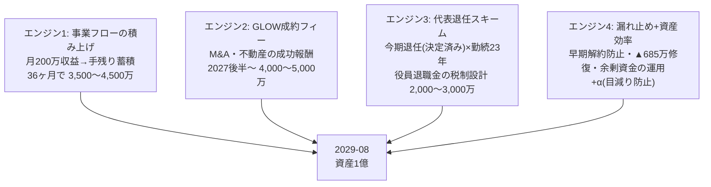

# 資産1億 3年逆算プラン(2026-07-30 → 2029-08)

対象: 小柳健さん(1981-08-27生・44歳)。**期限: 2029年8月=48歳の誕生月。残り36ヶ月。**
位置づけ: 「月200万逆算ロードマップ」の上位目標。月次収益(フロー)を資産(ストック)に転換する設計。

## 0. 最初に決めること: 「1億」の定義

| 定義 | 中身 | 難易度 | 備考 |
|---|---|---|---|
| A. 現金性資産 | 現預金+有価証券(いつでも使える) | ★★★ | 月平均+278万の純蓄積が必要(ゼロベース時) |
| B. 純資産 | A+自社株評価+不動産等 | ★★ | 事業価値の成長で到達しやすいが流動性なし |
| **推奨: A6:B4のハイブリッド** | 現金性6,000万+事業/不動産価値4,000万 | ★★☆ | 「使える1億」と「育つ1億」の両取り |

※現在の資産残高・役員報酬・各社の利益水準はリポジトリに情報がないため、以下は**ゼロベース積み上げの設計**。実数を入れると精度が上がる(四半期レビューで補正)。

## 1. 結論: 資産1億は「4つのエンジン」の合算で行く

**合計レンジ: 9,500万〜1億2,500万。** どれか1つに賭けるのではなく、4本とも仕込む。1本がゼロでも残り3本で9千万前後に乗る冗長設計。

### エンジン1: 事業フロー(床)— 月200万ロードマップそのもの
- 2027年前半に床130〜150万 → 2027年夏に180〜200万 → 以降維持・微増
- 36ヶ月の収益カーブを積分すると累計収益 約5,500〜6,500万 → **税・再投資後の手残り 3,500〜4,500万**
- ポイント: **法人に残すか個人に移すかの設計が税率を大きく変える**。個人最高税率(約55%)を避け、法人内留保→エンジン3の退職金原資に回すのが効率的(要税理士設計)

### エンジン2: GLOW成約フィー — 「圧倒的」の主役はここ
- M&A仲介の成功報酬はレーマン方式で**1件500万〜2,500万**が相場帯。不動産も1件あたり仲介+関連収益
- 公式目標「2027年8月〜 M&A20件/年」に対し、資産逆算で必要なのは**あなたの取り分ベースで3年合計4,000〜5,000万**=控えめに見て「2027年に1〜2件・2028年に3〜4件・2029年前半に2件」の成約で足りる
- **今の最重要変数は7000件リストの投入時期**。手紙→ゆんたく→案件化のリードタイムは6〜12ヶ月なので、**8月に投入しないと2027年の成約第1号が2028年にずれ、エンジン2全体が1年遅れる**

### エンジン3: 代表退任スキーム — あなたが既に決めている事が最大の資産イベント
- 「今期を代表最後と設定」は、実は資産形成上の最重要イベント。**勤続23年の役員退職慰労金は、退職所得控除(23年分)+1/2課税で、通常の報酬より税率が劇的に低い**
- 原資は法人利益+保険(エンライフ本業の知見がそのまま使える領域)。逆算上は2,000〜3,000万を無理なく設計できる可能性が高い
- **注意**: 退任後も実質的に経営に関与し続けると税務上否認されるリスクがある(「分掌変更」の要件)。権限委譲を本気でやる=あなたの承継方針と税務要件が一致する。**顧問税理士との設計を今期中に開始**(決裁済みの経費精算の税理士確認と同じ窓口で一緒に依頼できる)
- ザ・プロズの「現金を貯める」機能・フクギイロの資産管理的な位置づけも、この設計に組み込む

### エンジン4: 漏れ止め+資産効率
- 早期解約防止(保全システム): 継続手数料の防衛=エンジン1の目減り防止
- 参謀本部の▲685万穴の修復: 本業利益の回復=エンジン3の原資増
- 蓄積した現金の置き場所: 3年と期限が短いためハイリスク運用はしない。安全運用+事業再投資が原則(1億の達成確率を運用益に依存させない)

## 2. 年次マイルストーン

| 期 | 資産残高目標(累計) | 何が起きているか |
|---|---|---|
| 2026年度末(2027-03) | 500〜1,000万 | 床130万稼働・7000件投入済み・退職金設計着手・漏れ止め稼働 |
| 2027年度末(2028-03) | 3,000〜4,000万 | 床200万維持・GLOW成約1〜2件・代表退任実行(退職金第1弾) |
| 2028年度末(2029-03) | 7,000〜8,500万 | GLOW 3〜4件/年ペース・床の価格改定・M&A20件体制の果実 |
| **2029-08(48歳)** | **1億** | 判定。不足時はエンジン2の期末成約 or 自社株評価(定義B)で補完 |

## 3. 今週の意思決定との接続(全部つながっている)

| 今フラグが立っているタスク | エンジン | 遅らせた場合の資産インパクト |
|---|---|---|
| ノビシロ掲載決裁 | 1 | 1ヶ月遅れ=床の立ち上がり遅延で累計▲100万超 |
| 7000件リスト投入 | 2 | **1ヶ月遅れ=成約カーブ全体が後ろへ。最大▲1,000万級** |
| 代表退任の税理士設計開始 | 3 | 期をまたぐと退任タイミング選択肢が減る |
| 保全実データ投入(外部専門家) | 4 | 解約1件ごとに継続手数料が消え続ける |
| 出口座組4問・値札3つ | 1 | 床32万分の欠落が続く |
| board修復・見張り番 | 4 | 誤った数字での資源配分が続く |

## 4. 追跡の仕組み(圧倒的に行くための計器盤)

1. **四半期の資産レビュー**を統括(アカリさん)の週次レポとは別枠で設置: 4エンジン別の残高・進捗率・次四半期の一手。初回は2026-10月
2. **現在値の投入**: 現預金・役員報酬・各社利益の実数が入ると、このプランの精度が「レンジ」から「予測」に上がる(数値は非公開リポジトリ or ローカル管理。公開リポジトリには置かない)
3. **月200万ロードマップのM3レビュー(2026-10)** と同じタイミングで資産カーブとの乖離をチェック

## 5. 正直な注意書き

- エンジン2(GLOW)は分散が大きい。だから床(エンジン1)と退職金(エンジン3)で6割を固める設計にしてある
- エンジン3は**税理士の設計が必須**(この文書は税務助言ではない)。分掌変更・功績倍率・保険活用は専門家と
- 「圧倒的に行く」の最大の敵は資金でも戦略でもなく、**あなたの時間の配分**。この3年で一番リターンが高いあなたの行動は「決裁を即日返すこと」と「人を指名すること」— 今日までの2日間でそれが実証されている(決裁が出た項目は全て当日中に実装まで到達した)
