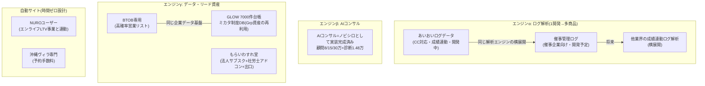

# 資産1億 個人ポートフォリオ確定版(2026-07-30)

小柳さん確定の【個人】チャット7本: **あいおいログデータ / BTOB専用 / AIコンサル / 催事管理ログ / NUROユーザー / 沖縄ヴィラ専門 / もらいわすれ堂**
+ 新提案分(退任スキーム等)で、2029年8月までに個人資産1億。Grp完全達成が最優先の前提は不変。

---

## 1. 最大効率の発見: 7事業は「実質3エンジン+2自動サイト」に圧縮できる

7本を別々に立ち上げると時間が7倍かかる。しかし中身を見ると**開発資産・データ資産・知見が使い回せる**ため、実質は3つのエンジンに束ねられる:

- **エンジンα**: あいおい向けに開発中の「成績連動ログ解析」は、**催事管理ログと同じエンジン**。あいおいで完成→催事版は設定替えで出せる。しかも催事の最初の実証顧客は**エンライフ催事部門自身**(Grpの予算達成にも効く=二重取り)
- **エンジンβ**: 「AIコンサルサイト」はノビシロとして**すでに実装完成・決裁待ち**。7本の中で唯一、今週から売上が立てられる
- **エンジンγ**: BTOB専用サイトは、GLOWの7000件台帳・ミカタの企業DBと**同じデータ資産の商品化**。ゼロから作らず、Grpで作った基盤の「外販パッケージ」として設計する
- **NURO・ヴィラ**: 集客も運営も自動化前提で作り、**あなたの時間を1分も使わない**設計にする。NUROはエンライフのLTV事業(保全時のネット回線案内)と同じ商材なので、個人サイト側は「エンライフの営業が使える紹介ページ」を兼ねる

## 2. 1億への配分(個人エンジン別・3年レンジ)

| エンジン | 収益モデル | 3年累計(仮) | 立ち上げ順 |
|---|---|---|---|
| β AIコンサル(ノビシロ) | 顧問サブスク+診断 | 2,500〜3,500万 | **①今週**(掲載決裁のみで開始) |
| α-1 あいおいログデータ | コンサル報酬+システム月額 | 1,000〜1,500万 | **②開発中→8-9月商品化**(顧客は既に居る) |
| α-2 催事管理ログ | システム月額5〜10万×5〜10社 | 1,000〜2,000万 | ③エンライフ催事で実証(2026H2)→外販(2027) |
| γ-1 BTOB専用 | リストサブスク月1〜3万×20〜50社 | 500〜1,000万 | ④GLOW台帳基盤の流用でMVP(2027H1) |
| γ-2 もらいわすれ堂 | 法人サブスク+士業アドオン+出口 | 500〜1,000万 | ⑤出口座組決裁→弁護士→M5でβ |
| 自動 NURO+ヴィラ | 成果報酬・予約手数料 | 300〜700万 | ⑥完全自動設計で2027年に小さく |
| 新提案 P3退任スキーム | 役員退職金+株式・配当設計 | 2,000〜3,000万 | **①今週着手**(税理士電話) |
| **合計** | | **7,800万〜1億2,700万** | |

## 3. 立ち上げ順の理由(効率の原則)

1. **「顧客が既に居る」ものから**: あいおい(取引中)・催事(エンライフ自身)・ノビシロ(実装済み) — 新規開拓コストゼロの3本を先に
2. **「Grp資産を使い回せる」ものを次に**: BTOB専用・もらいわすれ堂出口 — Grpの完全達成がそのまま個人側の開発を進める
3. **「時間を食う新規業界」は最後・自動化前提で**: ヴィラ(観光業)・NURO — 2027年、エンジンα/βが回ってから
4. **同時に立ち上げるのは常に2本まで**: あなたの実働(週5〜8時間)が分散した瞬間に全部が遅れる。今はβ(ノビシロ)+α-1(あいおい)の2本

## 4. 四半期ロードマップ

| 期 | エンジン側 | 個人資産残高目標 |
|---|---|---|
| 2026 Q3(〜9月) | ノビシロ公開・初売上 / あいおいログ解析システム完成・商品化 / 税理士設計開始 / 催事ログ仕様を三名体制へ | 仕込み期 |
| 2026 Q4(〜12月) | ノビシロ顧問1〜3社 / あいおい月額化 / 催事ログをエンライフ催事部門で実証開始 | 500万 |
| 2027 H1 | 催事ログ外販1〜3社 / BTOB専用MVP(GLOW基盤流用) / もらいわすれ堂法人サブスクβ | 1,500〜2,500万 |
| 2027 H2 | 退任実行(退職金第1弾) / NURO・ヴィラ自動サイト稼働 | 4,000〜5,000万 |
| 2028年度 | 全エンジン巡航+価格改定 / GLOW成約の個人取り分が乗り始める | 7,000〜8,500万 |
| **2029-08** | **判定: 1億** | **1億** |

## 5. 今日〜今週やること(確定版)

**今日(変更なし・5件70分)**: ①もらいわすれ堂LINE§D反映 ②嶺井さんへ7000件一報 ③**税理士電話**(退職金+電帳法+返金方針) ④board承認+見張り番指名 ⑤外部専門家アポ

**今週(個人ポートフォリオ始動の3決裁)**:
1. **ノビシロ掲載承認**(エンジンβの販売開始) — 決裁キュー🟠の筆頭
2. **催事管理ログの商品化指示** — 「催事ログの仕様・価格・提案書を三名体制で作れ」の一言でAI側が着手。あいおいエンジンの横展開設計から始める
3. **BTOB専用の位置づけ決定** — GLOW台帳(PR#12)をマージし、「この基盤を外販商品としても設計する」方針を追記するだけで二重利用が始まる

## 6. 追加提案: 7本より「もっと早い」個人収益(即金系)

7本のエンジンは立ち上げに3〜12ヶ月かかる。**2026年内のキャッシュギャップを埋める最速の商品は、あなたが既に持っている「実績と信用」の時間販売**。開発ゼロ・仕入れゼロで、意思決定した週から売れる:

| 案 | 商品 | 単価(仮) | 速さ | 根拠となる既存資産 |
|---|---|---|---|---|
| ★1 | **経営顧問(月額・2〜3社限定)** — 「ゆんたく経営相談室」の有料版。月1回訪問+チャット相談 | 月10〜30万/社 | **今週から売れる** | 23年経営・12年代表・リストラゼロ・M&A/投資家対応経験。GLOWの手紙リスト・商工会人脈が販路 |
| ★2 | **AI経営導入の研修・伴走(単発→顧問)** — 「エージェント組織で会社を回す」実演型。**hojo-hqのこの仕組み自体がデモ** | 研修20〜50万/回、伴走は月額 | 今月から | この2日間の実績(決裁→当日稼働)がそのまま営業資料。ノビシロの上位商品としても機能 |
| ★3 | **ログ解析「導入診断」の先売り** — システム完成前に「現状診断+導入設計」を単発商品化 | 50〜100万/件 | 8月から | あいおい・催事の開発中エンジン。診断だけなら今の知見で納品できる |
| 4 | **保険代理店向け 組織づくり研修** — 催事集客・共同募集・保全組織のノウハウを県外代理店へ | 30〜100万/社 | 9月〜 | エンライフの実績(協会認定・9部門・平均給与TOP20)。競合しない県外に限定 |
| 5 | **講演(商工会・金融機関)** — 直接収益より★1〜3の営業装置として | 5〜20万/回 | 随時 | 提携部の士業・商工会・金融機関ネットワークが既にある |

**推奨の使い方**: 即金枠は「あなたの時間を売る」商品なので、**合計で週2〜3時間・2026年内は月50〜100万を上限**に絞る(超えるとGrp最優先の原則が崩れる)。2027年にエンジンα/βのストック収入が立ったら、即金枠は縮小して単価を上げる。**★1と★2は同じ商談で同時に売れる**(顧問契約+AI伴走のセット)。

この即金系を足すと2026年内に+300〜500万が現実的になり、四半期ロードマップのQ4目標(500万)が「エンジン待ち」から「自力で到達可能」に変わる。

## 7. ガードレール

- Grp完全達成が最優先: 決裁バッチ週90分を超えたら個人側の新規着手を止める
- 同時立ち上げ2本まで(現在: β+α-1)
- 個人資産の実数管理は非公開リポジトリ(公開repoに数字を置かない)
- あいおい・催事ログは**顧客の成績データ=PII級**。保全システムと同じセキュリティ関門(外部専門家・分離環境)を通す — 今日の⑤がここでも効く
