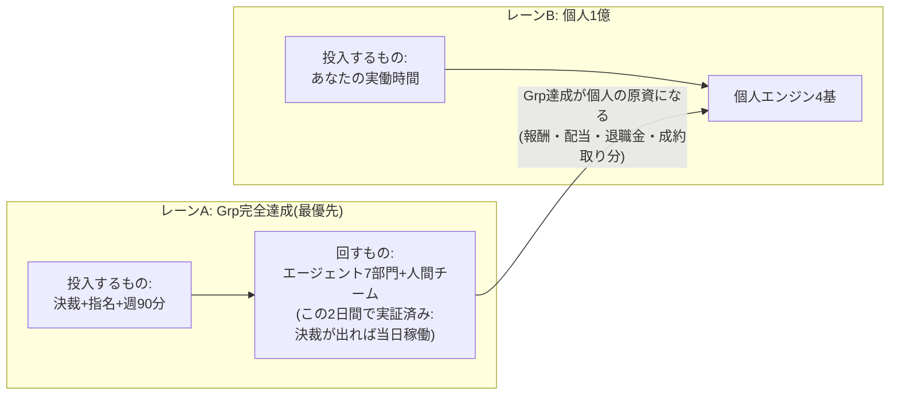

# 資産1億 個人設計v2(2026-07-30)— 「Grp完全達成が最優先」を前提にした二層アーキテクチャ

初版(資産1億_3年逆算プラン)からの変更点: 小柳さんの定義確定を反映。
- **1億の定義**: 【個人】チャット群のタスク+新提案から生まれる**個人資産**で2029年8月までに1億
- **制約条件(最優先)**: ALLGROUP全体(エンライフ9部門予算・ミカタ1000社・もらいわすれ堂・GLOW体制)の**完全達成を犠牲にしない**
- ※【個人】ラベルのチャット一覧はリポジトリから見えないため、個人帰属収益(ノビシロ・あいおいコンサル・ログ解析商品・退任スキーム等)と仮定。リスト提供で精緻化する

---

## 1. 設計の核心: 「二層レーン」— 時間の使い方を分ける

矛盾しそうな2つの目標(Grp完全達成 × 個人1億)は、**投入するリソースの種類が違う**ので両立できる:

- **レーンA(Grp)は「あなたの時間を使わない」設計にする**のが最大の効率化。決裁キュー(docs/決裁キュー.md)+委任パッケージ+自動化(週次レポLINE配信・SNS自動投稿・見張り番)で、あなたの投入は**決裁バッチ週90分**まで圧縮する
- **レーンB(個人)にあなたの実働を集中投下する**。ただしレーンAの決裁が詰まるとレーンBの原資も止まる(下の変換経路)ので、順序は常に「Aの決裁→Bの実働」

## 2. Grp完全達成 → 個人1億への「変換経路」(ここが効率の源泉)

Grpの目標達成は、それ自体が個人資産に変換される。**別々に頑張る必要がない**:

| Grp側の完全達成 | 個人資産への変換 | 3年での個人インパクト(仮) |
|---|---|---|
| エンライフ9部門予算達成+▲685万修復+早期解約防止 | 法人利益→**役員退職金の原資**(勤続23年・今期退任・1/2課税) | 2,000〜3,000万 |
| ミカタ1,000社+GLOW「M&A20件/年」体制 | 成約フィーの**個人取り分**(役員報酬・配当設計は税理士と) | 2,000〜3,000万 |
| もらいわすれ堂+出口座組 | フクギイロ(夫婦会社)の利益→**世帯資産** | 500〜1,000万 |
| グループの信用・実績・事例 | 個人事業(ノビシロ・コンサル)の**受注単価と成約率を押し上げる営業資産** | 単価×成約率の増分 |

→ **Grp完全達成は個人1億の「敵」ではなく「最大の供給源」。** だから最優先に置いても1億は遅れない。

## 3. 個人エンジン4基(レーンB・あなたの実働先)

| エンジン | 中身 | 3年目標 | 実働の性質 |
|---|---|---|---|
| P1. ノビシロ(個人事業の主砲) | 顧問サブスク8/15/30万+診断1.48万 | 累計2,500〜3,500万 | 決裁→公開→**初期顧客だけあなたが営業**(3社まで)→以降は仕組み |
| P2. コンサル・システム商品 | あいおい生命コンサル(稼働中)+CC対応ログ解析システム+催事企業向けログ解析の**商品化** | 累計1,000〜1,500万 | **すでに持っている知見の値札付け**。開発はAI・販売はあなたの人脈 |
| P3. 退任スキーム | 役員退職金+株式・配当設計 | 2,000〜3,000万 | 税理士との設計会議のみ(実働ほぼゼロ・効率最強) |
| P4. GLOW個人取り分 | M&A・不動産成約の個人帰属分 | 2,000〜3,000万 | 嶺井さん体制が主・あなたはゆんたく相談の**看板と最終クロージング**のみ |

**合計レンジ: 7,500万〜1億1,000万** + フクギイロ世帯分500〜1,000万 = **1億ライン**。
P3が「実働ゼロで2千万級」の最効率エンジンなので、**税理士設計の着手が個人1億の最速の一手**。

## 4. 週の時間割(最大効率の型)

| 枠 | 時間 | 中身 |
|---|---|---|
| 決裁バッチ(レーンA) | **週90分×1回**(例: 月曜朝) | docs/決裁キュー.md を上から裁く+人の指名。これでGrp全体が1週間自走 |
| 個人実働(レーンB) | 週5〜8時間 | P1顧客対応 / P2商品化の壁打ち / P4クロージング同席 |
| 専門家会議 | 月2時間 | 税理士(P3)・外部セキュリティ・弁護士 |
| 計器盤レビュー | 月30分 | 個人資産残高×4エンジン進捗(非公開管理) |

※月曜8:00の週次レポLINE自動配信(稼働開始済み)が決裁バッチの直前に届く設計になっている。

## 5. 「やった方がいいこと」個人版・新提案

1. **P3を今週着手**: 税理士への電話1本(退職金設計+電帳法+ノビシロ返金方針の3案件同時)。個人1億の時間効率が最も高い一手
2. **個人計器盤の非公開化**: 現預金・報酬・各社利益・4エンジン残高を**非公開リポジトリ**で月次管理(保全システムのPII分離と同じ1決裁で作れる)。公開リポジトリには一切置かない
3. **税制枠の総点検**(税理士会議の議題に追加): 小規模企業共済・iDeCo・経営セーフティ共済など、経営者個人の非課税/繰延枠を全部使っているかの棚卸し。使い残しがあれば「ノーリスクの積み上げ」
4. **P2の商品化を三名体制に投げる**: 「催事場ビジネス企業向け 成績連動ログ解析」を商品仕様+価格+提案書の形にする議論はAI側で回せる。あなたは採否のみ
5. **個人の時間ログを週次レポに1行追加**: レーンA(決裁)に使った時間が90分を超え始めたら委任の失敗シグナル。仕組みで検知する

## 6. 実行順(今日〜今週・変更なしで両レーンに効く)

今日の5件(LINE§D反映 / 7000件一報 / 税理士電話 / board承認+指名 / 専門家アポ)は、**レーンAの完全達成とレーンBの1億の両方に同時に効く**ように選んである:
- LINE§D・board・専門家 → レーンA(Grp)
- 税理士電話 → レーンB(P3=個人最効率エンジン)の起動
- 7000件一報 → 変換経路(GLOW)の起動

今週の決裁バッチ(ノビシロ掲載承認ほか)で P1 が販売開始。以降は週90分の決裁+週5〜8時間の個人実働のリズムに入る。

## 7. リスク管理

- **レーンBがレーンAを侵食し始めたら、Bを止めてAを守る**(定義通り最優先はGrp)。判定基準は「決裁バッチが週90分で収まっているか」「Grpの月次KPIが緑か」
- P3(退職金)は税務要件(分掌変更)が絶対条件。退任後の実質関与を残さない=権限委譲を本気でやることが、理念と税務の両面で必須
- 数字はすべてレンジ(仮)。個人の実数(現在資産・報酬)が入り次第、月次で「予測」に更新する
