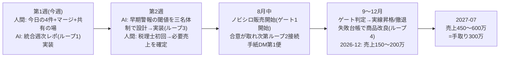

# 達成確率を上げる設計 — 既存の仕組みを「5つのループ」に接続する(2026-07-31)

対象目標: ①Grp完全達成(最優先) ②個人手取り300万/月(売上450〜600万・2027-08前) ③資産1億(2029-08)
考え方: 新しい仕組みはほぼ作らない。**既に稼働している仕組み同士を接続して「外れたらすぐ分かる・自動で戻る」構造**にする。達成確率は「計画の良さ」ではなく「軌道修正の速さ×リード供給の太さ」で決まる。

---

## 0. 既に持っている仕組み(棚卸し)

| 分類 | 稼働中の仕組み |
|---|---|
| 供給 | 収集パイプライン(毎日2回)/ SNS自動投稿(月水金)/ LIFF診断→企業台帳(基準❺)/ 会話ボット / glow-ma台帳(スコアリング・掘り起こしアラート・DNC・成約率履歴=Phase7) |
| 販売 | 自動販売機(Stripe×GAS×Claudeレポート)/ ノビシロ7ページ+診断(公開決裁待ち) |
| 計測 | GA4+Clarity+Plausibleファネル / 週次レポ自動生成+毎週月曜8:00 LINE配信 / 反映監査+見張り番(エンライフ) |
| 防衛 | churnリスクモデル+PIIガード+隔離ランブック / 失敗台帳+ニドナシ機構 |
| 統治 | 三名体制スキル / 決裁キュー / ステージゲート(7/31新設) / 議事・決裁ログ |

## 1. ループ1「計器盤ループ」— 全目標を毎週月曜の1通に集約する

**現状の穴**: 週次レポはもらいわすれ堂のみ。Grp KPI・個人ストックの進捗は毎回チャットで手動確認している(この3日間で3回発生)。
**接続**: 既存の週次レポ生成器(weekly_report_fukugiiro.py+月曜LINE配信)を拡張し、**1通に統合**する:
- Grp信号(🟢🟡🔴): ミカタLINE登録数 / 掲載150件 / エンライフboard整合(見張り番の結果) / GLOW台帳の接触消化率(Phase7履歴から自動)
- 個人ストック信号: 8商品の**契約件数とゲート状態**(点線→実線の昇格判定)※金額は公開リポジトリに置かず件数のみ
- 決裁キュー残数と最古の滞留日数(**決裁レイテンシ**を数値化 — 唯一あなた起因の変数)
**効果**: 「最新状況の確認」への依頼が不要になり、逸脱の発見が最大7日以内に保証される。
**着手**: AI側で実装可能。決裁不要。

## 2. ループ2「リード供給ループ」— 4本の川を1つの台帳に落とす

**現状の穴**: 流入(ミカタ診断・SNS・手紙DM・紹介)と個人商品の販売が未接続。
**接続**: すべての経路が既に台帳へ落ちる設計になっている(基準❺+glow-ma+会話ボット)。残る接続は2つだけ:
1. **ミカタ台帳→GLOW台帳の橋**(流入ルート③として取り込む機能は実装済み・運用開始だけ)
2. **台帳→個人商品の処方箋**: ノビシロ診断レポートの改善提案に8商品を自動掲載(自動販売機の設定変更)
**前提条件**: Grpリードの個人商品への利用は**嶺井さん・遥さん合意+ライセンス整理が先**(三名体制検証の裁定)。→ 合意が取れた瞬間に接続できるよう、実装だけ先に済ませておく。
**効果**: 売上450〜600万に必要な顧客数(概算50〜90社)を、新規開拓ゼロで既存の川から供給できる。**1,000社基盤=個人目標の分母**になる。

## 3. ループ3「早期警報ループ」— 外れたら7日以内に分かる閾値を先に決める

参謀本部の「反映監査」の思想を全目標に展開。**閾値を下回ったら週次レポが🔴を出し、決裁キューに自動で議題が立つ**:

| 指標 | 🔴閾値(例・三名体制で確定させる) | 検知元 |
|---|---|---|
| ミカタLINE登録ペース | 週20社未満が2週連続 | 台帳集計 |
| ノビシロ診断→顧問転換 | 3ヶ月でゲート(3社)未達 | リード台帳 |
| 手紙DM反応率 | 100通あたり反応2件未満 | glow-ma Phase7履歴 |
| SNS→サイト流入 | 投稿12本で流入ゼロ | GA4 |
| 決裁レイテンシ | 最古の決裁待ち14日超 | 決裁キュー |
| 解約 | 月次解約率3%超 | 契約台帳 |
**効果**: 「12ヶ月後に未達と判明」が構造的に起きなくなる。ゲート不合格2本で2027-01に軌道修正する判断も、このループが自動で持ち上げる。

## 4. ループ4「学習ループ」— 失敗台帳を売上側にも使う

**現状の穴**: 失敗台帳・ニドナシ機構はデータ品質の事故にしか使われていない。
**接続**: ゲート不合格・解約・断られた商談を**同じ失敗台帳形式で記録**し、月末の「前提破壊レビュー」(三名体制規程5)で商品・価格・売り方を更新する。断られた理由こそ市場検証ゼロ問題(ウタガイ指摘)の解毒剤。
**効果**: 8商品のうちどれが伸びるか事前に当てる必要がなくなる。**外して学ぶ速度**が確率になる。

## 5. ループ5「決裁ループ」— あなた起因のレイテンシを仕組みで最小化

この4日間の実証: 決裁が出た項目は当日稼働、出ない項目は無期限停止。つまり**達成確率の最大変数はあなたの決裁速度**。
- 決裁キューを毎朝の「決裁便」としてLINEへ自動配信(週次レポ配信と同じ基盤で実装可能。以前提案した仕組み — 実装の承認だけ必要)
- 決裁は「採用/不採用/保留+理由1行」の3択返信でよい形式に統一(ウタガイ反対付きの上申は既に運用中)
- 週90分の決裁バッチを**カレンダーの固定枠**にする(唯一のあなたの習慣変更)

## 6. 道筋(この順で接続する)

## 7. AI側で今すぐ着手できるもの(あなたの決裁不要・実装のみ)

1. 統合週次レポ(ループ1)— 件数ベース・金額なしで公開repo内に実装
2. ミカタ台帳→GLOW台帳の橋の運用手順書+処方箋掲載の実装(接続はスイッチOFFのまま準備)
3. 早期警報の閾値案(三名体制議事つき)→ あなたに上申
4. ゲート判定テンプレ+失敗台帳の商談版フォーマット

## 8. あなたにしか出来ないもの(確率に直結する順)

1. 今日の4件(LINE§D/税理士/board承認+指名/専門家アポ)
2. 本ブランチ+PR3本のマージ(ループ1〜5の土台が全チャット共通になる)
3. 嶺井さん・遥さんとの共有の場(ループ2の解禁条件)
4. 週90分決裁バッチのカレンダー固定+毎朝の決裁便の承認
5. ノビシロ掲載承認(ゲート1の号砲)
